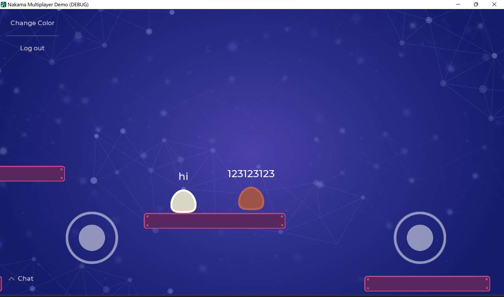

# 基于Godot游戏引擎和Nakama游戏后端的移动游戏

关于Nakama相关学习和介绍请看[英文版README](./README_en.md)

## 介绍
本项目基于`nakama`官方示例, 游戏图示如下

### 1. 多人游戏、可聊天

### 2. 增加虚拟按键和摇杆-安卓设备支持

#### 导出
1. 首先需要`安装Android构建模板`
2. 修改`.\godot\android\build\AndroidManifest.xml`中文件增加联网权限
3. 导出时勾选`使用自定义构建`

## 目前问题
- `nakama`同步不太好、也可能是我给的虚拟机配置不够,多人同屏时一卡一卡的
- 人物碰撞有些问题, 一个人站在另一个人人头上时下面的人动不了, 俩人相向而行可能直接穿模而过
- UI样式优化、增加位置调节
- 增加技能增加地图增加可玩性 `O(∩_∩)O`
